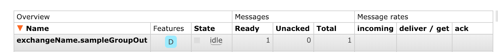
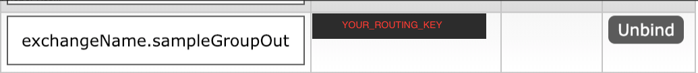

# Less Boring RabbitMQ + Spring Cloud Stream

> If you know all about Rabbit MQ and the potential of Spring Cloud Stream proceed.

- Generate the project using Spring initializer. The POM must have everything except the binding to Rabbit


- Add the bindings dependency mapping it to RabbitMQ ( not Kafka ), the above step would have done this , but calling out

        <dependency>
                <groupId>org.springframework.cloud</groupId>
                <artifactId>spring-cloud-starter-stream-rabbit</artifactId>
        </dependency>

- Create the mapping class if you don't want `input` and `output` to be a default Queue in and Queue out.

        // To read from a Queue
        import org.springframework.cloud.stream.annotation.Input;
        import org.springframework.messaging.SubscribableChannel;
    
        public interface PreferredExchangeNameSink {
    
            String INPUT = "privin";
    
            @Input("privin")
            SubscribableChannel input();
        }
    
        // To write to a Queue
        @Component
        public interface CustomSource {
    
    
            String OUTPUT = "privout";
    
            @Output(OUTPUT)
            MessageChannel output();
    
        }

- Now map the above `bindings` in the `[application.properties](http://application.properties)` file.

    
    ```spring.cloud.stream.bindings.privin.group=sampleGroupIn
    spring.cloud.stream.bindings.privin.destination=exchangeName
    spring.cloud.stream.rabbit.bindings.privin.consumer.bindingRoutingKey=someotherrouting.user.created
    
    
    spring.cloud.stream.bindings.privout.group=sampleGroupOut
    spring.cloud.stream.bindings.privout.destination=exchangeName
    spring.cloud.stream.rabbit.bindings.privout.producer.routingKeyExpression='domain.user.created'
    
    # Just In Case properties below
    spring.rabbitmq.host=localhost # RabbitMQ host.
    spring.rabbitmq.password=guest # Login to authenticate against the broker.
    spring.rabbitmq.port=5672 # RabbitMQ port.
    spring.rabbitmq.username=guest # Login user to authenticate to the broker.```

- `@EnableBindings` to the above created class in `ANY` class

    // Mulitple class can be given
    @EnableBinding({ PreferredExchangeNameSink.class})

- To publish a message into a queue and to read from a queue.

    	```	@Autowired
        CustomSource customSource;
    
        public static void main(String[] args) {
            SpringApplication.run(LoggingConsumerApplication.class, args);
        }
    
        @StreamListener(PreferredExchangeNameSink.INPUT)
        public void handle(Person person) {
            System.out.println("Received : " + person);
    
            FoodOrder foodOrder  = new FoodOrder();
            foodOrder.setRestaurant("Olive Garden");
     
           customSource.output().send(MessageBuilder.withPayload(foodOrder).build());
    
    
        }```

- To test the published message,
    1. Create a queue in the format of `<EXCHANGE_NAME>.<QUEUE_NAME_OF_YOUR_CHOICE` . In the above example `.destination` defines the exchange name which is in our case `exchangeName`.

        

    2. The queue name can be anything.
    3. Then map the queue name with the `routingKey` mentioned in the properties file to the exchange.

    
